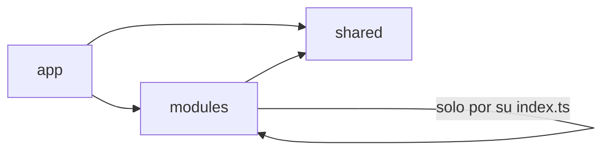

# Arquitectura del frontend

Cómo está organizado el frontend y qué reglas seguir al agregar código. Si algo no está aquí, copia el patrón del **módulo de favoritos** (`src/modules/favorites`), que es la referencia.

- **Sistema de diseño:** [sistema-de-diseno.md](sistema-de-diseno.md) · catálogo vivo en `/_ui` (desarrollo)
- **Contrato de la API:** repo del backend → `docs/api/convenciones.md` y `docs/api/endpoints.md`, y la documentación interactiva en `http://127.0.0.1:8000/docs/api`

## 1. Stack

| Pieza | Uso |
|-------|-----|
| Vue 3.5 + `<script setup lang="ts">` | Componentes |
| TypeScript 5.9 (estricto) + `vue-tsc` | Tipos, revisados en CI |
| Vite 8 | Desarrollo y build |
| Tailwind CSS 4 | Estilos, solo con los tokens de `src/app/main.css` |
| Vue Router 5 | Rutas |
| Pinia 4 | Estado global mínimo: sesión y toasts |
| Pinia Colada 1.4 | Datos del servidor: consultas, caché e invalidación |
| VeeValidate 4 + Zod 3 | Formularios y validación |
| Laravel Echo + pusher-js | Tiempo real con Laravel Reverb |
| @lucide/vue | Íconos |
| Vitest + Vue Test Utils | Tests |
| ESLint + oxlint + Prettier | Calidad y formato |

## 2. Estructura

```
src/
├── app/                    Arranque y "esqueleto" de la aplicación
│   ├── main.ts             Plugins, configuración del cliente HTTP, montaje
│   ├── main.css            Tokens de diseño (Tailwind @theme)
│   ├── router/             Router: junta las rutas de los módulos + guardas
│   ├── layouts/            AuthLayout, PublicLayout, ClientLayout, ProfessionalLayout, navbar, footer
│   └── views/              Páginas que no son de ningún módulo (404)
├── shared/                 Lo que usan varios módulos. Cambios aquí los revisan los dos.
│   ├── ui/                 Componentes base (BaseButton, BaseInput…) — index.ts
│   ├── components/         Componentes de dominio presentacionales (ProfessionalCard)
│   ├── http/               Cliente HTTP único y ApiError
│   ├── forms/              Mensajes de Zod en español y errores del servidor → campos
│   ├── realtime/           Conexión con Reverb (Echo)
│   ├── stores/             Toasts
│   ├── types/              Espejo de la API: envelope, modelos, rutas
│   └── utils/              Formatos de dinero, fechas, duración
└── modules/                Un módulo por funcionalidad: lo que se reparte entre el equipo
    ├── auth/  catalog/  professionals/  favorites/  bookings/
    ├── dashboard/  professional-profile/  schedule/  home/
    └── styleguide/         /_ui, solo en desarrollo
```

### Reglas de dependencia



- `shared/` **nunca** importa de `modules/` ni de `app/`.
- `modules/` nunca importa de `app/`.
- Un módulo importa a otro **solo desde su `index.ts`** (`@/modules/auth`), nunca un archivo interno. ESLint lo bloquea.
- Dentro de un módulo se usan rutas relativas (`../queries`).
- Si dos módulos se necesitan mutuamente, lo compartido baja a `shared/` (así pasó con `ProfessionalCard`).

## 3. Anatomía de un módulo

Ejemplo real: `src/modules/favorites/`

```
favorites/
├── api.ts              favoritesApi: una función por endpoint, tipada con el envelope. Sin lógica.
├── queries.ts          useFavorites(), useToggleFavorite(): Pinia Colada + keys.
├── components/         Componentes del módulo (FavoriteButton.vue)
├── views/              Páginas (MyFavoritesView.vue). Sufijo View obligatorio.
├── routes.ts           favoritesRoutes: ModuleRoutes (por área)
├── index.ts            API pública del módulo: lo que otros pueden importar
└── __tests__/          Tests del módulo
```

Opcionales según el módulo: `schemas.ts` (Zod), `status.ts` (etiquetas y tonos de estados), `store.ts` (solo si hay estado global de verdad; hoy solo auth).

## 4. Datos del servidor (Pinia Colada)

Todo dato que viene de la API se maneja con **queries** y **mutations**, no con stores de Pinia.

```ts
// queries.ts
export const bookingKeys = {
  all: ['bookings'] as const,
  detail: (id: number) => ['bookings', 'detail', id] as const,
}

export function useBooking(id: MaybeRefOrGetter<number>) {
  return useQuery({
    key: () => bookingKeys.detail(toValue(id)),
    query: async () => (await bookingsApi.find(toValue(id))).data,
  })
}

export function useCancelBooking() {
  const queryCache = useQueryCache()
  return useMutation({
    mutation: ({ id, reason }: { id: number; reason: string }) => bookingsApi.cancel(id, reason),
    onSettled: () => queryCache.invalidateQueries({ key: bookingKeys.all }),
  })
}
```

Reglas:
- Cada módulo define sus **keys** en un objeto `<modulo>Keys`, empezando por el nombre del recurso.
- Las mutations **invalidan** las keys afectadas; la UI se actualiza sola. No se copia la respuesta a mano en otra variable.
- En la vista: `const { data, isPending, error, refetch } = useX()` y los cuatro estados de la sección 7.
- Pinia (stores) solo para estado global que **no** viene del servidor: la sesión (`useAuthStore`) y los toasts.

## 5. Cliente HTTP

`src/shared/http/client.ts` es el único que llama a `fetch`.

- `http.get/post/put/patch/delete<T>()` devuelven el envelope de la API (`ApiSuccess<T>` o `ApiPaginated<T>`).
- Archivos: `toFormData(valores)` (arrays → `campo[]`).
- Cualquier error llega como `ApiError` con `status`, `message` (en español, listo para mostrar) y `errors` (en 422).
- Un 401 con sesión iniciada cierra la sesión y lleva al login (configurado en `app/main.ts`).

## 6. Formularios (VeeValidate + Zod)

Patrón completo en `src/modules/auth/components/LoginForm.vue`:

```ts
const { defineField, errors, handleSubmit, isSubmitting, setErrors } = useForm({
  validationSchema: toTypedSchema(loginSchema),
})
const [email, emailAttrs] = defineField('email')

const onSubmit = handleSubmit(async (values) => {
  try {
    await authApi.login(values)
  } catch (error) {
    formError.value = applyServerErrors(error, setErrors) // 422 → campos; resto → mensaje
  }
})
```

```vue
<BaseInput v-model="email" v-bind="emailAttrs" label="Correo" :error="errors.email" />
```

Reglas:
- **Los nombres de campo son los del request de la API** (`snake_case`): los errores 422 del backend caen en el campo correcto sin traducir nombres.
- El esquema Zod va en `schemas.ts` del módulo y replica las reglas del FormRequest del backend. El backend vuelve a validar siempre.
- Los mensajes de Zod salen en español (`spanishErrorMap`, registrado en `main.ts`); personaliza solo cuando aporte (`'Selecciona tu comuna.'`).
- Campos de archivo: `useField<File | null>('avatar')` en lugar de `defineField`, que pierde el tipo `File`.
- Formularios por pasos: un esquema por paso y `validationSchema: computed(...)` (ver `RegisterProfessionalForm.vue`).
- Error general del formulario → `BaseAlert tone="danger"` arriba del formulario.

## 7. Estados de una vista y feedback

Toda vista con datos maneja cuatro estados, en este orden (ver `MyFavoritesView.vue`):

| Estado | Componente |
|--------|-----------|
| Cargando | `BaseSkeleton` con la forma aproximada del contenido |
| Error | `BaseAlert tone="danger"` + botón Reintentar (`refetch`) |
| Vacío | `BaseEmptyState` con una acción ("Buscar profesionales") |
| Contenido | La lista o el detalle |

Feedback de acciones:
- Acción completada → **toast** (`useToastStore().success(response.message)`).
- Error de un formulario → **BaseAlert** dentro del formulario.
- Confirmar algo destructivo → **BaseModal** (ver `CancelBookingModal.vue`).
- **Nunca** `alert()`, `confirm()` ni `prompt()` del navegador.

## 8. Rutas

Cada módulo exporta un `ModuleRoutes` desde su `index.ts` y `app/router/index.ts` lo monta:

| Área | Layout | Prefijo | Acceso |
|------|--------|---------|--------|
| `public` | PublicLayout | `/` | Todos |
| `guest` | AuthLayout | `/` | Solo sin sesión |
| `client` | ClientLayout | `/client` | Sesión de cliente |
| `professional` | ProfessionalLayout | `/professional` | Sesión de profesional |

- Nombres de ruta en `kebab-case` con el área como prefijo: `client-bookings`, `professional-booking-detail`.
- Navegar siempre por nombre: `:to="{ name: 'professional-detail', params: { id } }"`, nunca rutas escritas a mano.
- `meta.title` pone el título de la pestaña.
- Las guardas son comodidad de navegación; la seguridad la aplica el backend.

## 9. Tipos

`src/shared/types/models.ts` es el **espejo de los Resources del backend**. Si un PR del backend cambia un Resource, el PR del frontend actualiza el tipo. Ningún componente define su propia versión de `Booking`, `Professional`, etc.

## 10. Tiempo real

`src/shared/realtime/echo.ts`: la sesión conecta y desconecta Echo. Para escuchar un canal:

```ts
getRealtime()?.join(`booking.${id}`).listen('.message.sent', (message: Message) => { … })
```

Canales y eventos: repo del backend → `docs/tiempo-real.md`. Al recibir un evento, invalida la key correspondiente o actualiza la caché del módulo.

## 11. Tests

- Archivos en `__tests__/` junto al código: `src/modules/favorites/__tests__/FavoriteButton.spec.ts`.
- Mínimo por módulo: los esquemas Zod y un componente con su interacción principal.
- Para componentes con datos: mockear `<modulo>Api` con `vi.mock('../api')` y montar con Pinia, Pinia Colada y un router de memoria (copiar el test de `FavoriteButton`).
- `npm run test:unit` en modo observador; `npx vitest run` una vez.

## 12. Estado de los módulos (fase 0)

| Módulo | Estado |
|--------|--------|
| `auth` | ✅ Conectado: login, registro de cliente y de profesional, sesión |
| `catalog` | ✅ Conectado: comunas y categorías |
| `professionals` | ✅ Conectado: búsqueda con filtros en la URL y perfil |
| `favorites` | ✅ Conectado — **módulo de referencia** |
| `bookings` | ✅ Conectado: listado, detalle, cancelación con motivo |
| `home` | 🟡 Maqueta: categorías y destacados de muestra |
| `dashboard` | 🟡 Maqueta: paneles de cliente y profesional con datos de muestra |
| `professional-profile` | 🟡 Maqueta: "Sobre mí" y "Mis servicios" |
| `schedule` | 🟡 Maqueta: disponibilidad |

Las maquetas compilan y usan los tokens, pero sus datos están escritos en el código. Se conectan al implementar su módulo.

## 13. Checklist para un módulo nuevo

1. Crear `src/modules/<modulo>/` copiando la estructura de `favorites`.
2. `api.ts` con los endpoints del contrato (repo del backend → `docs/api/endpoints.md`).
3. Tipos nuevos en `src/shared/types/models.ts` si la API devuelve un recurso nuevo.
4. `queries.ts` con keys, queries y mutations.
5. Vistas con los cuatro estados; componentes base de `@/shared/ui`.
6. `schemas.ts` para formularios, con nombres de campo de la API.
7. `routes.ts` + exportar desde `index.ts` + sumarlo en `app/router/index.ts`.
8. Enlaces de navegación en `app/layouts/navigation.ts` si aplica.
9. Tests en `__tests__/`.
10. `npm run lint`, `npm run type-check`, `npx vitest run` y `npm run build` en verde.
